# Práctica 2 Unity: Introducción C# - Scripts PARTE 2

## Autor

Daniel Palenzuela Álvarez (alu0101140469)

## Descripción

Práctica realizada utilizando Unity 6.6 y C#.

## Ejercicio 5: Posiciones mediante un marcador

Se ha añadido un GameObject vacío denominado `Marcador` y el script `Ejercicio5Marcador.cs`, que actúa como objeto de configuración. El marcador contiene tres desplazamientos de tipo `Vector3`, uno para cada objeto de la escena. Al pulsar la barra espaciadora se aplica a cada objeto su desplazamiento respecto a la posición inicial:

`posición final = posición inicial + desplazamiento`

Los desplazamientos se pueden modificar desde el Inspector, en este caso he seleccionado los siguientes desplazamientos.

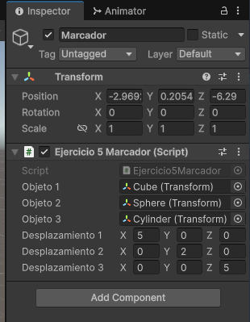

### Ejecución

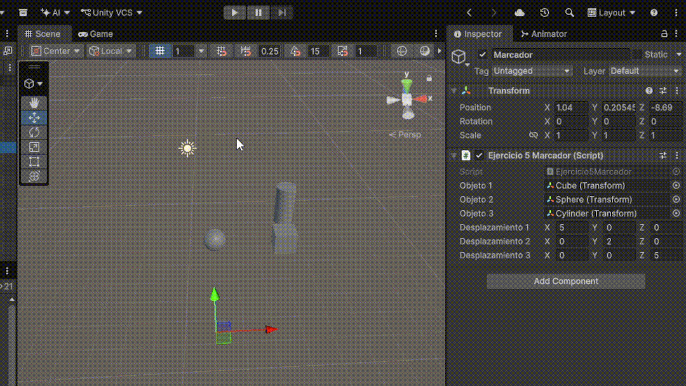

---

## Ejercicio 6: Velocidad y teclas de dirección

El cubo dispone del script `Ejercicio6Flechas.cs` y de una variable `speed`, configurable desde el Inspector. Se utilizan los ejes `Horizontal` y `Vertical` para obtener los valores de entrada y las teclas de dirección para identificar qué flecha se ha pulsado. Cada pulsación muestra en la consola el nombre de la flecha y el resultado de multiplicar la velocidad por el valor correspondiente del eje.

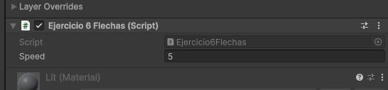

### Ejecución

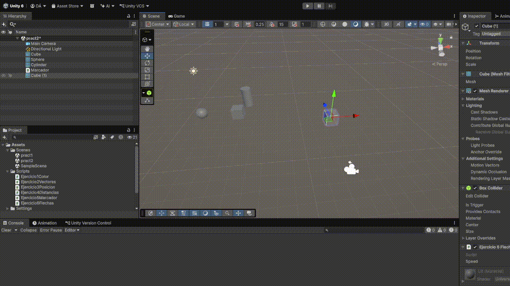
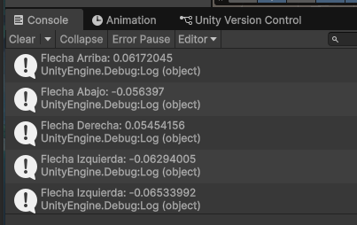

---

## Ejercicio 7: Mapeado de la tecla H

Se ha configurado el Input Manager para asociar la tecla H al botón virtual `Fire1`. Cuando se pulsa `H`, el script `Ejercicio7Disparo.cs` detecta `Fire1` y ejecuta la función `Disparo()`, mostrando un mensaje en la consola.

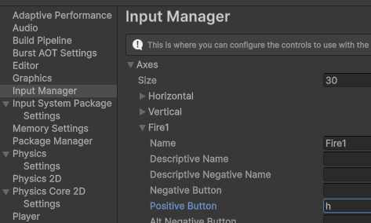

### Ejecución

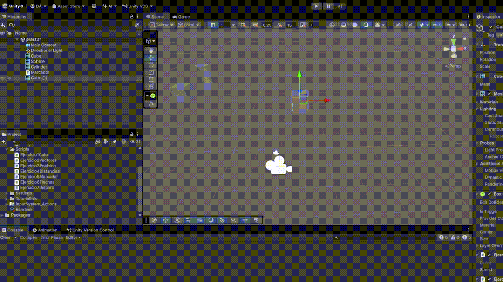
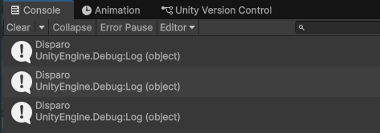

---

## Ejercicio 8: Movimiento mediante Vector3

El cubo con el script `Ejercicio8MovimientoVector.cs` utiliza dos variables públicas, `moveDirection` de tipo `Vector3` y `speed`, de tipo `float`. El movimiento se realiza mediante `Transform.Translate`.

Ejecución por defecto con movimiento x=0.01 y speed=2:  

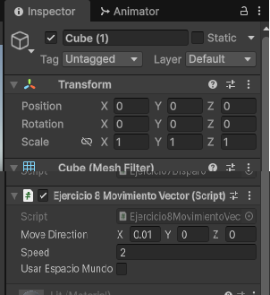
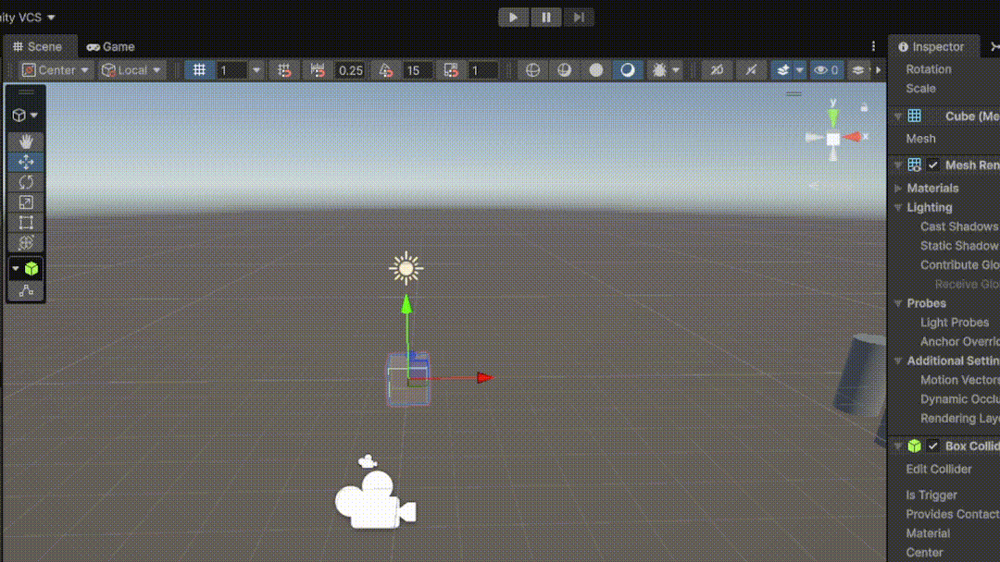

### Resultados de las ejecuciones

#### a. Duplicar las coordenadas de la dirección

Al duplicar las coordenadas de `moveDirection`, se mantiene la dirección del movimiento pero se duplica el desplazamiento realizado en cada iteración.

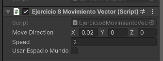
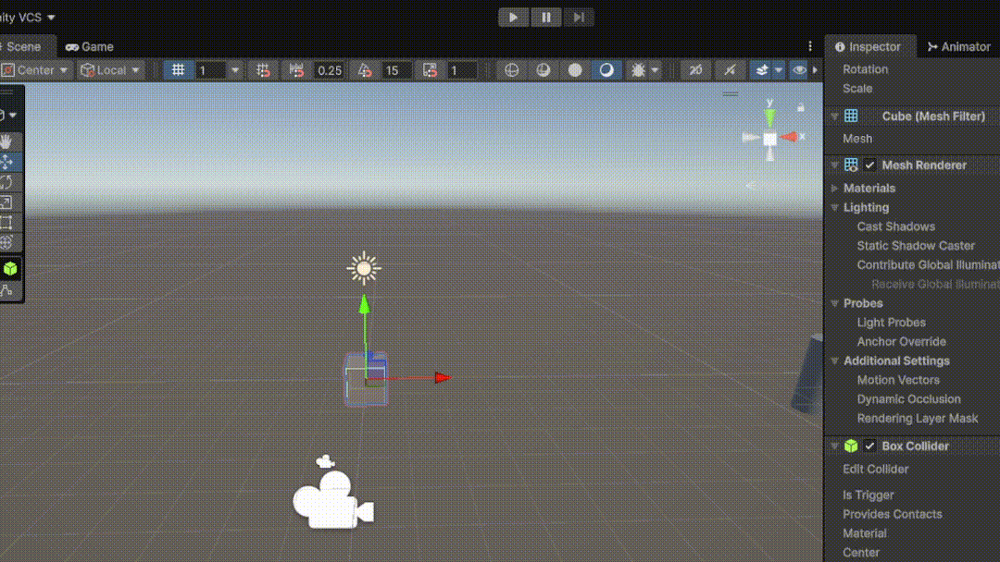

#### b. Duplicar la velocidad

Al duplicar `speed`, el objeto se desplaza en la misma dirección pero recorre el doble de espacio en cada iteración.

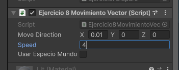

#### c. Velocidad menor que 1

Con una velocidad menor que 1, el desplazamiento realizado en cada iteración es menor y el cubo se mueve más lentamente.

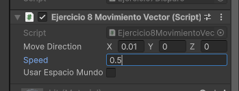

#### d. Posición inicial con Y mayor que 0

Al colocar el cubo a una altura mayor que 0, su posición vertical inicial cambia. Si la componente Y de `moveDirection` es 0, el cubo mantiene dicha altura mientras se desplaza.

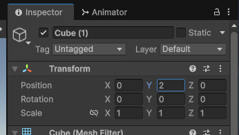
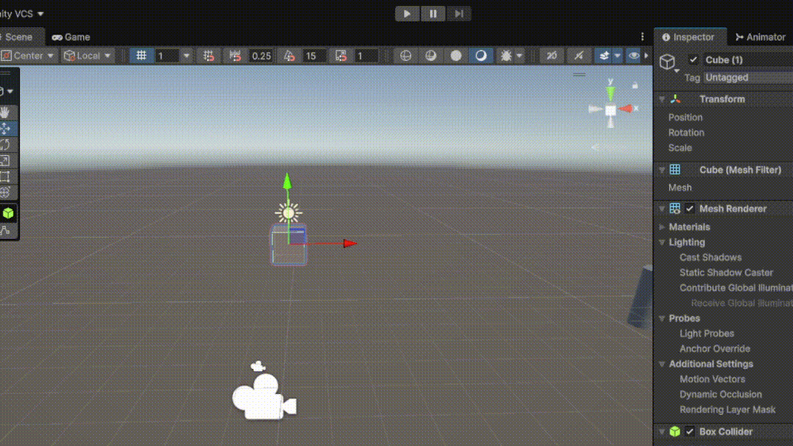

#### e. Espacio local y espacio mundial

Con movimiento relativo al espacio local, los ejes utilizados dependen de la orientación del objeto.

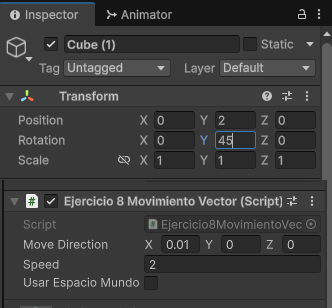
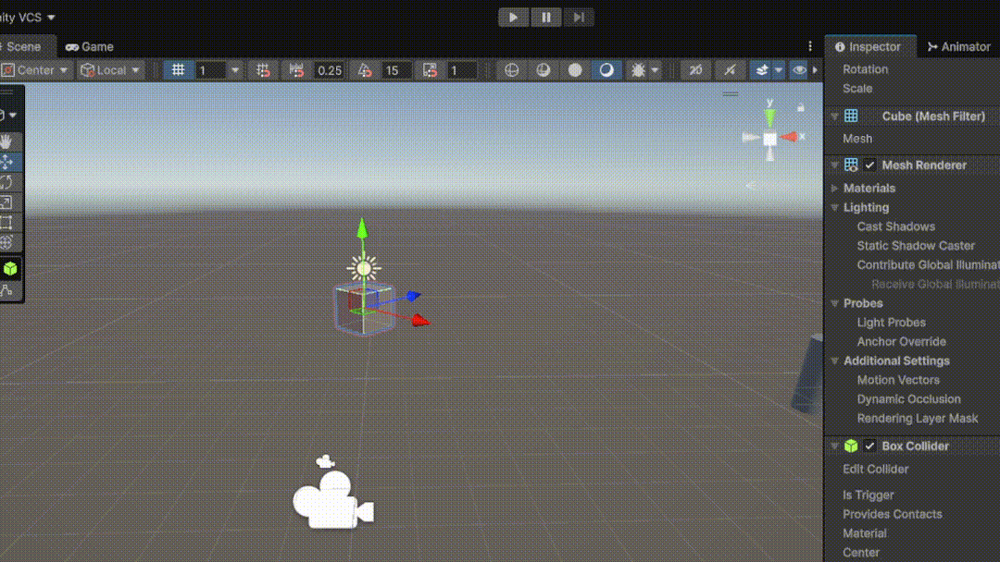

Con movimiento relativo al espacio mundial, el movimiento utiliza los ejes globales de la escena independientemente de la rotación del objeto.

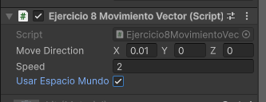

---

## Ejercicio 9: Movimiento mediante teclado

El cubo con el script `Ejercicio9Movimiento.cs` se mueve mediante las teclas de dirección y la esfera mediante las teclas `W`, `A`, `S` y `D`. La variable `speed` permite modificar la velocidad desde el Inspector.

### Ejecución

Parámetros cubo:  
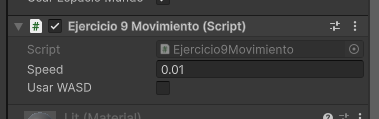

Parámetros esfera:  
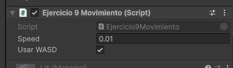  

---

## Ejercicio 10: Movimiento proporcional al tiempo

Se ha adaptado el movimiento del ejercicio anterior multiplicando el desplazamiento por `Time.deltaTime` usando el script `Ejercicio10MovimientoDeltaTime.cs`. Esto permite que la velocidad se interprete como una cantidad de unidades por segundo y que el movimiento sea independiente de la duración de cada frame.

### Ejecución

Parámetros cubo:  
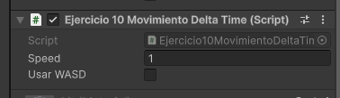

Parámetros esfera:  
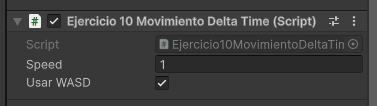  

---

## Ejercicio 11: Movimiento hacia la esfera

El cubo localiza la esfera mediante un tag `blue_sphere` que se le debe asignar.

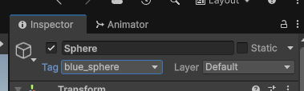

En cada frame se calcula el vector que une la posición del cubo con la posición de la esfera, y el componente Y del vector se anula para evitar modificar la altura del cubo. La dirección se normaliza antes de aplicar el movimiento, de manera que la distancia entre los objetos no modifica la velocidad de avance.

### Ejecución

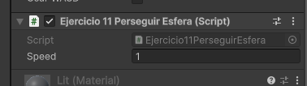
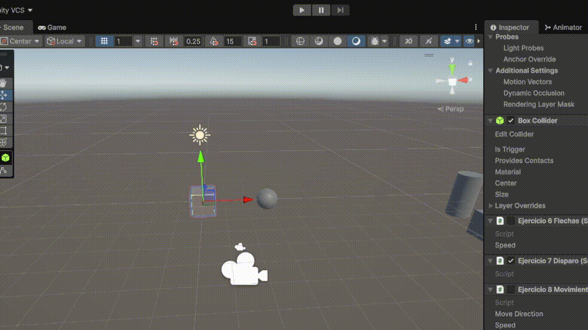

---

## Ejercicio 12: Orientación hacia la esfera

El cubo debe mirar siempre hacia la esfera mientras avanza, para ello se utiliza el script `Ejercicio12LookAt.cs` y con `Transform.LookAt` se usa para orientar el cubo de forma que su eje Z positivo apunte hacia la esfera. La posición objetivo se mantiene a la misma altura que el cubo para evitar inclinaciones verticales.

La posición de la esfera se puede modificar durante la ejecución mediante las teclas `W`, `A`, `S` y `D`, permitiendo comprobar cómo el cubo cambia continuamente su orientación.

### Ejecución

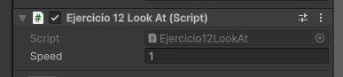
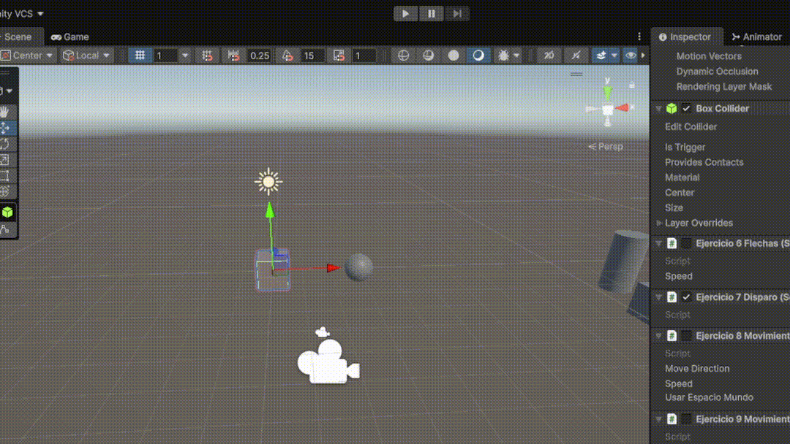

---

## Ejercicio 13: Giro y avance mediante Forward

El objeto avanza continuamente utilizando en el script `Ejercicio13AvanzarGirar.cs` el `transform.forward`, por lo que el desplazamiento siempre se realiza en la dirección de su eje Z positivo. El eje `Horizontal` controla la rotación del objeto alrededor del eje Y.

También se utiliza `Debug.DrawRay` para visualizar la dirección de avance durante la ejecución y facilitar la depuración.

### Ejecución

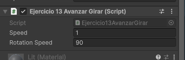
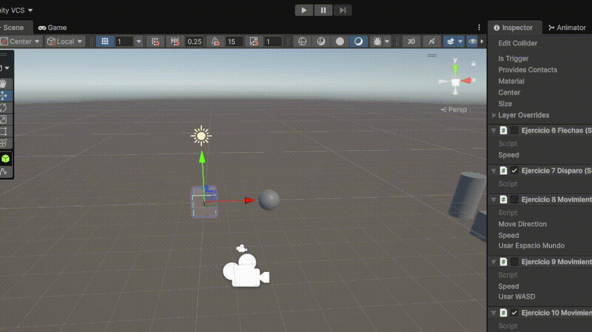
