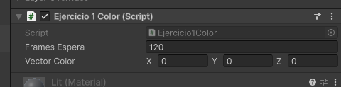
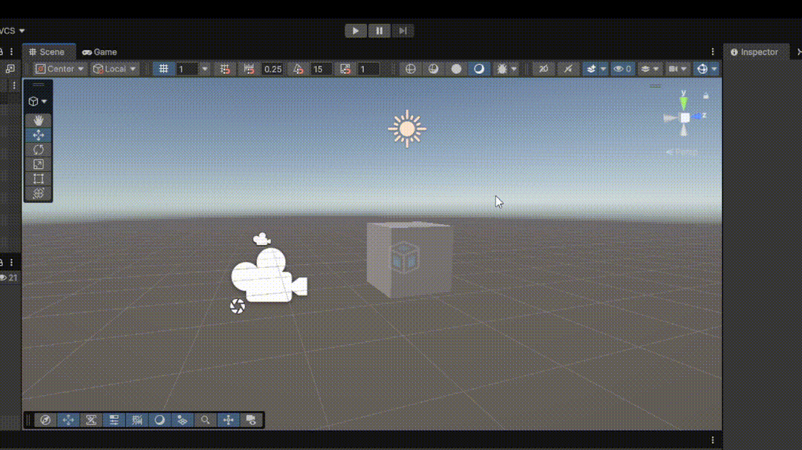
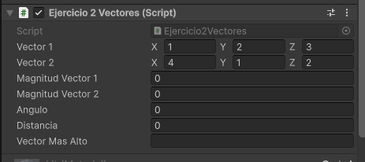
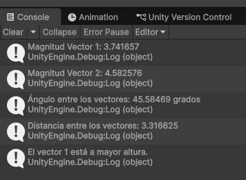
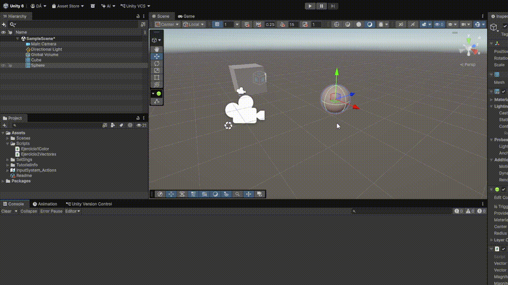
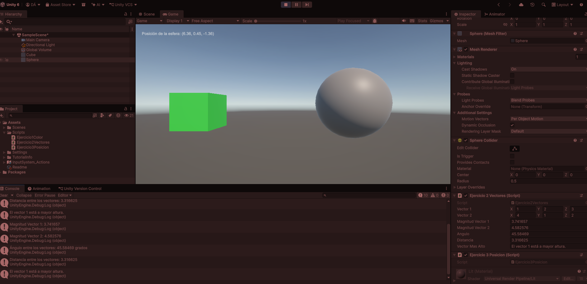
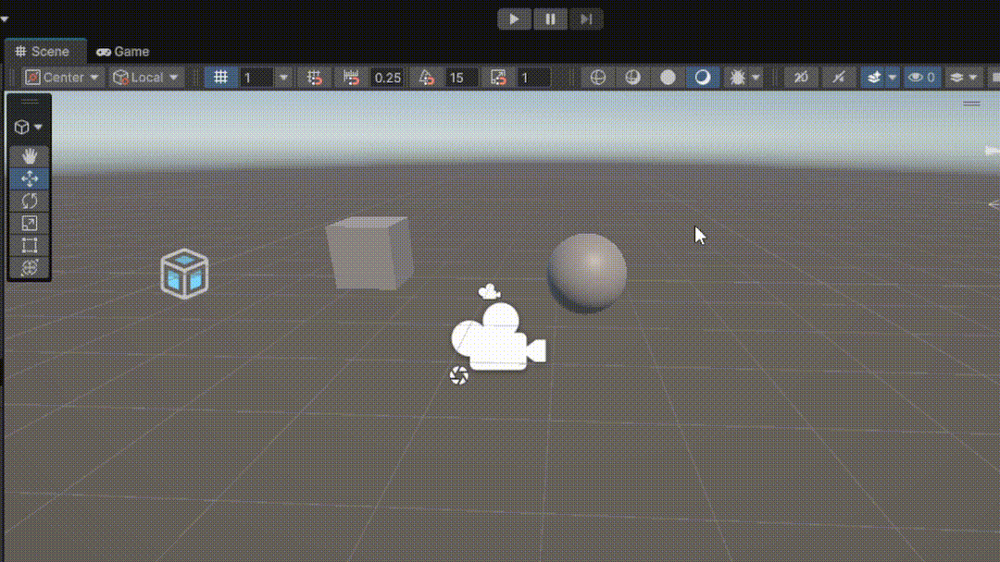
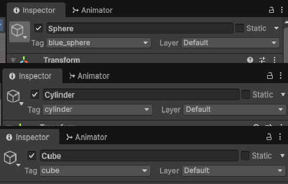
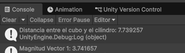
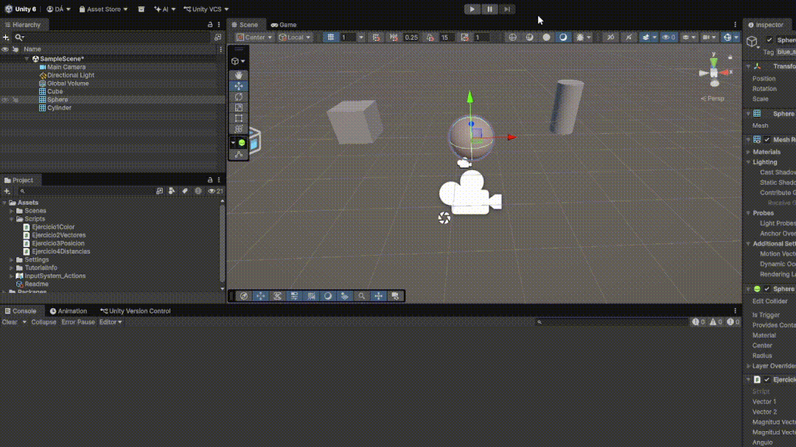

# Práctica Unity: Introducción C# - Scripts

## Autor

Daniel Palenzuela Álvarez (alu0101140469)

## Descripción

Práctica realizada utilizando Unity 6.6 y C#. En ella se trabajan vectores Vector3, colores Color, componentes de GameObjects, posiciones mediante Transform y búsqueda de objetos mediante Tags.

## Ejercicio 1: Cambio aleatorio de color

Creo en un cubo en GameObject y en addcomponent le asocio y creo el script `Ejercicio1Color.cs`, donde el script inicializa un Vector3 con tres valores aleatorios entre 0 y 1, utilizándolo como componentes RGB de un color.
Cada cierto número de frames se selecciona aleatoriamente una de las tres componentes del vector y se modifica su valor. El número de frames de espera se puede modificar desde el Inspector mediante la variable pública framesEspera.

### Ejecución

---

## Ejercicio 2: Operaciones con Vector3

Creo el GameObject Esfera y le asocio y creo el script `Ejercicio2Vectores.cs`, donde el script utiliza dos vectores `Vector3` configurables desde el Inspector y calcula:

* Magnitud del primer vector.
* Magnitud del segundo vector.
* Ángulo entre ambos vectores.
* Distancia entre ambos.
* Vector situado a mayor altura según su componente Y.

Los valores antes de ejecutar:  

Al ejecutar:  

Los resultados se muestran tanto en la consola como en el inspector.

### Prueba

---

## Ejercicio 3 - Posición de la esfera

Se ha creado el script `Ejercicio3Posicion.cs` y se asocia a la esfera anterior. El script obtiene la referencia al componente `Transform` de la esfera y muestra su posición mediante un texto en pantalla. Se utiliza `transform.position` para obtener las coordenadas X, Y y Z.

### Prueba

---

## Ejercicio 4 - Distancia entre cubo y cilindro

Se ha creado el GameObject Cilindro, y se asocia a la esfera anterior el script `Ejercicio4Distancias.cs`. Los objetos se localizan mediante sus Tags y posteriormente se obtiene su componente `Transform` para acceder a sus posiciones.

Finalmente se calcula y muestra en consola la distancia entre el cubo y el cilindro mediante `Vector3.Distance`.

### Prueba

